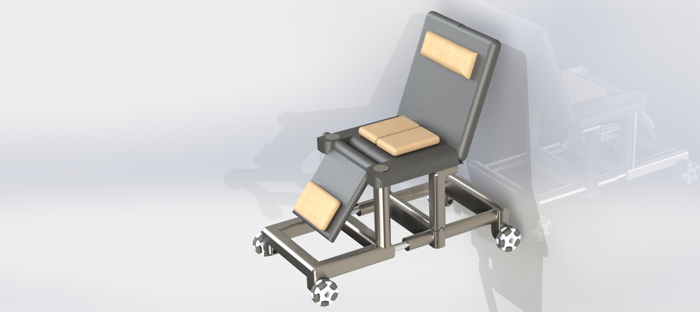
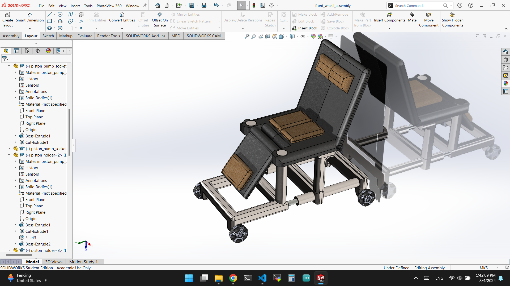
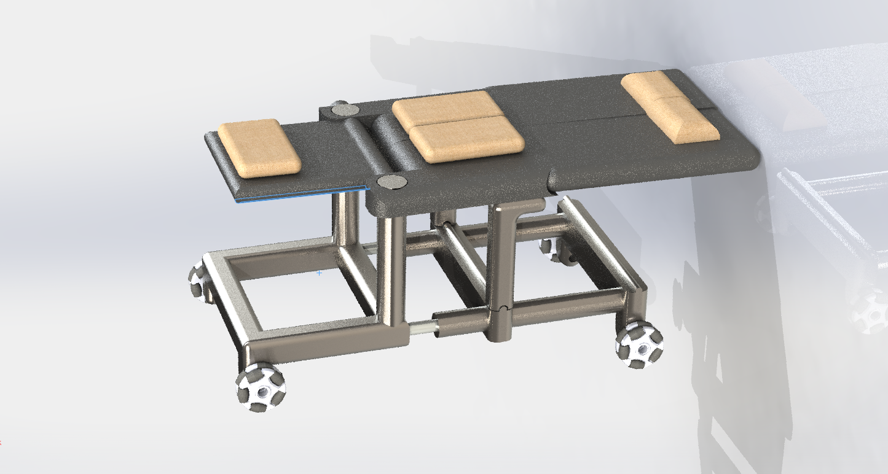
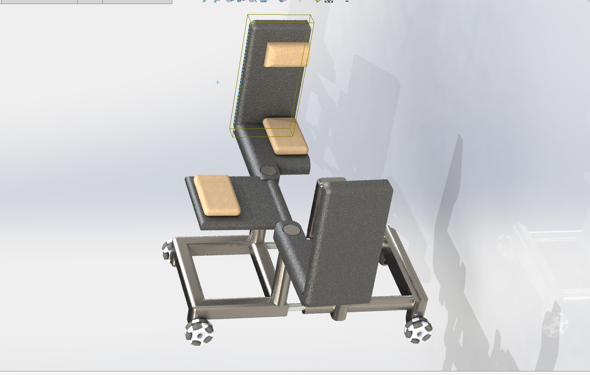
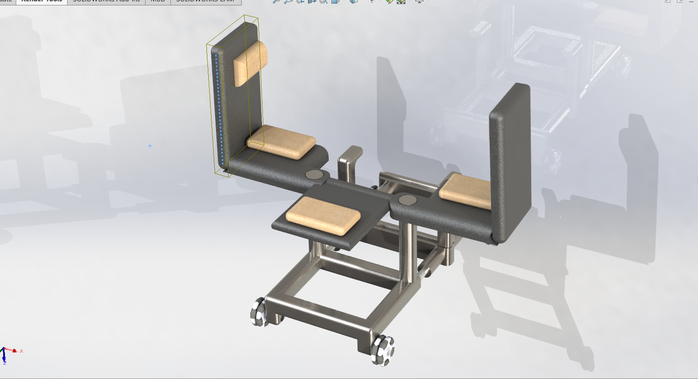

# GDP

## GO Disabled People

## Prototype video
https://www.loom.com/share/d6ba4b911c4a47fdb4ba29bd1ce95598?sid=698c8be1-3c93-48c5-8fb3-197124e4a65f

### Solution Ideas

- Development of wheelchair robots to assist paralyzed individuals.
- Voice command integration for wheelchair robots to enhance convenience.
- AI features for better user interaction and assistance.
- Ergonomic designs to reduce strain on caregivers and family helpers.

### Business Outcomes

- Hospitals will purchase wheelchair robots, leading to reduced labor costs.
- Paralyzed individuals and their families will save money and time, and reduce physical strain.
- Increase in caregiver job satisfaction due to reduced physical demands.
- Enhanced independence and quality of life for paralyzed individuals.

### Business Problem

- High costs and physical strain associated with hiring caregivers for paralyzed individuals.
- Difficulty in moving paralyzed patients without appropriate tools, leading to caregiver injuries.
- Hospitals seeking cost-effective solutions to manage labor expenses.

### Users and Customers

- Paralyzed individuals and their families.
- Hospitals and healthcare facilities.
- Caregivers and family helpers.

### User Benefits

- Paralyzed individuals gain more independence and mobility.
- Families and caregivers can provide care more efficiently and with less physical strain.
- Hospitals can reduce labor costs while ensuring better patient care.

### What's the Most Important Thing We Need to Learn First?

- The feasibility and cost-effectiveness of developing wheelchair robots with the desired features.

### Hypotheses

- **Hypothesis 1:** We believe that hospitals buying and using wheelchair robots will be achieved if hospitals protect nurses (caregivers) with wheelchair robots taking over patients' weight.
- **Hypothesis 2:** We believe that saving money for paralyzed individuals and saving their family helpers' time will be achieved if they rely on caregivers less by using wheelchair robots to transfer and move them around.
- **Hypothesis 3:** We believe that hospitals buying and using wheelchair robots will be achieved if hospitals save money on labor with wheelchair robots working for them.

### Riskiest Assumption

- The cost of making such wheelchair robots will be affordable and justified by the savings and benefits provided.

### Experiments to Validate Assumptions

- Conduct market research to estimate the demand and willingness to pay for wheelchair robots.
- Collaborate with mechanical engineers and AI experts to design a cost-effective prototype.
- Pilot the prototype in a few hospitals to gather feedback and assess cost savings.

### Next Steps

1. **Research and Development:** Collaborate with technical experts to design and prototype wheelchair robots.
2. **Cost Analysis:** Evaluate the manufacturing costs and potential savings for users.
3. **Pilot Testing:** Implement the prototype in selected hospitals and gather data on performance and user satisfaction.
